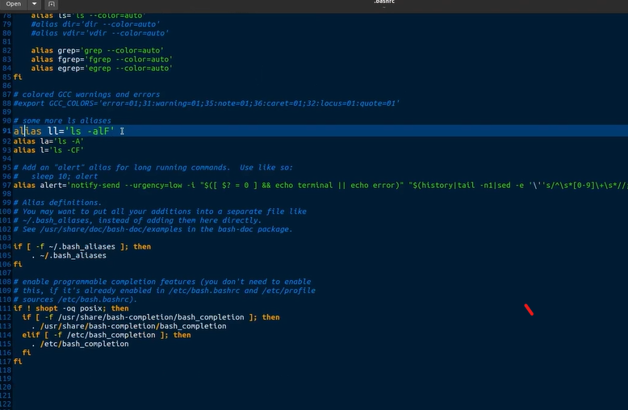

# Linux - systèmes d'exploitation 
Debian et Ubuntu sont deux distributions Linux populaires

Unix et Linux sont deux systèmes d'exploitation qui partagent une histoire et une architecture similaires, mais ils présentent également des différences importantes.

Linux peut être considéré comme une implémentation open source et moderne du concept Unix, qui a gagné en popularité en raison de sa disponibilité gratuite, de sa flexibilité et de son écosystème diversifié de distributions.

## Terminal/ Shell/ Prompt

$echo $SHELL --to know the shell type

ls
ls  -l (avec details) or -l -t (modifié plus recemment)
ls -l -r (les plus vieux elem en premier)
ls -l -t -r = ls -lrt

ls -lRt = plus details s'il y a des dossier avec des fichiers trouvé dans notre dossier ou on fait ls

ls -lRth = volume des fichiers traduit en oct or mb

ls -lrth rep1 liste que le repertoire 1 
lrt - options et rep1 est argument

ls -lrtha

affiche les fichiers cachés

il y a des commandes buitin et des commandes externe (present comme un fichier)
type echo --return echo is a shell builtin
type bash =bash is /usr/bin/bash 

file /usr/bin/bash --infos sur le fichier

 file /../* touts les fichiers
 
 cd /home/.../ && file * ---double commande
 echo un && echo deux

 id --command pour info sur l utilisateur 
type id  = comand extern presente dans un fichiere

echo $PATH

( id est executable car la commande se trouve definie dans un repertoire de path)

on peut ajouter des fichier a path pour pouvoir les executer de partout comme id comme ça: (repertoirie referencé dans la var path)
export PATH=$PATH:/adresse des fichiers qu on veut pouvoir executer de partout/ 
on verifie echo $PATH qui doit contenir l adresse just ajouté

help =liste des commandes interne dispo dan sle shell

help echo = details sur echo commande interne

commande externe( exp id) : commande --help

id --help = resumé
man (manuel) 
man id = plus detaillé

history

pour une commande de history:
!number qui se trouve apres ce qu'on tappe history

ctrl +r = recherche de commande avec une partie tappé
de nouveau ctrl+r pour remonter dans l'historique

#aliase
type ls = aliase...

pour ajouter des aliases on doit modifier le fichier .bashrc et ajouter 

declaration d alias:
ajouter dans .bashsrc
alias ll='ls -lrtha'

#resumés
ch1.2

Le terminal est l’outil de prédilection de l’administrateur Unix/Linux

Lorsque vous êtes physiquement devant la machine, vous utilisez une des 7 consoles proposées par Linux

Pour vous connecter à distance sur votre serveur Linux, vous utilisez un émulateur de terminal

Il existe des émulateurs de terminal pour Windows, macOS et bien sûr Linux

Terminal, émulateur de terminal, console… Avec ces outils, vous pouvez vous connecter localement ou à distance sur le serveur Linux à administrer. Quelle que soit la version du logiciel que vous allez utiliser, il vous faudra interagir avec le système en mode texte, c'est-à-dire saisir des commandes. Ce processus est assuré au moyen d'un shell que nous allons découvrir dans le prochain chapitre.

ch 1.3
Dans ce chapitre, vous avez :

compris en quoi consiste un interpréteur de commandes,

découvert quelques shell connus,

appris que le shell exécuté après l’étape d’authentification est configuré dans le fichier /etc/passwd  ,

et fait connaissance avec le shell standard de Linux : Bash. 

Dans le chapitre suivant, je vous propose de mettre en pratique ces notions et de passer un peu de temps sous Bash pour effectuer vos premières actions d'administration. On y va ?

ch1.4
La composition d’un prompt Linux et la variable$PS1(qui en définit chaque élément) n’ont plus de secret pour vous

Vous avez compris la structure des commandes sous Linux, avec leurs options et leurs arguments

Vous savez identifier les commandes internes et les commandes externes

Vous savez adresser une commande avec la variable$PATH

Vous savez lire plusieurs formes de documentation sous Linux 

Vous êtes désormais prêt à exécuter des instructions d'administration ! Je vous propose maintenant de tester vos connaissances. Dans la partie suivante, nous allons nous intéresser aux fichiers et notamment à la description de l'arborescence du système. Vous me suivez ?

test:
 