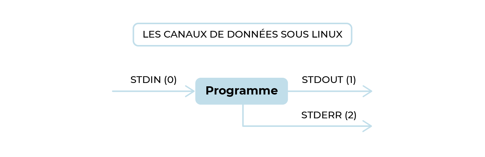
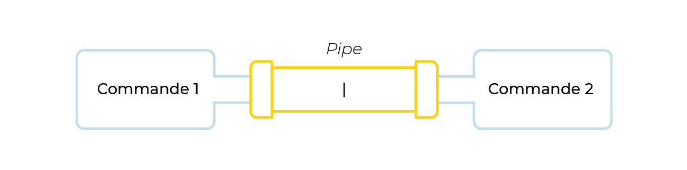
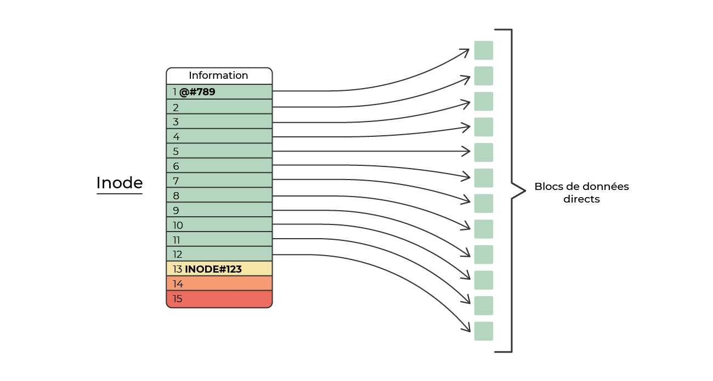
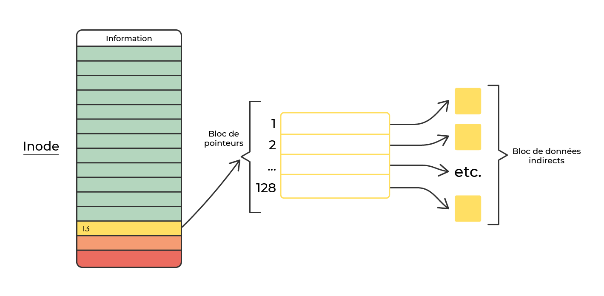

chapitre 2
# L'arborescence Linux

L'organisme responsable du maintien de la norme définissant l'arborescence des systèmes Unix/Linux : La fondation Linux https://www.linuxfoundation.org/

La norme définissant l'arborescence des systèmes Unix/Linux s'apelle FHS pour Filesystem Hierarchy Standard et est disponible sous plusieurs formats. 

Liste d'elements devant être presents sous la racine / depuis FHS( arborescence heritage des deux branches historiques des Unix SysremV et BSD)

##/root - pas stipule par la norme mais present quasiment sur toutes les distributions linux
-  créé pour stocker “les données personnelles de l'administrateur”
- il n'est pas indispensable pour faire démarrer le système et l'exploiter.
- stocker dans ce répertoire des données critiques pour le système est effectivement une erreur.

## /home -facultatif mais installé sur quasiment toutes les distributions 
- très contextuel, ce qui le rend impossible à normaliser
- FHS précise que les fichiers de configuration nécessaires aux utilisateurs qui souhaitent exploiter des applications et des programmes doivent être stockés dans un sous-répertoire de /home désigné par le login du compte utilisateur, préfixé d'un point "."

## /usr
-  répertoire  devenu avec le temps une arborescence majeure des distributions Linux. 
- contient lui-même des répertoires bin et sbin dans lesquels se situent également des commandes

logique de ces repertoires qui contient des commandes :

/bin: ce sont les commandes critiques pour le bon fonctionnement du système, quel que soit son objectif. Elles sont lancées par le système et par l'administrateur ;

/sbin: ce sont les commandes uniquement à destination de l'administrateur pour la gestion du système.

/usr/bin: ce répertoire contient majoritairement les commandes à destination de tous les utilisateurs du système, privilégiés ou non.

/usr/sbin: des commandes à nouveau à destination unique de l'administrateur, mais non critiques pour le bon fonctionnement du système.

/usr/local/bin : contient tous les binaires qui sont compilés manuellement par l'administrateur après l'installation du système.

Le répertoire/usr est très important, il est marqué "shareable" et "static", ce qui implique que d'un système à l'autre, les éléments contenus dans ce répertoire sont censés fonctionner exactement de la même manière.

## /var - stock toutes les informations utilisateurs, administrateurs et systèmes variables.

/var,/usr devrait pouvoir être utilisé en lecture seule 

Sous-répertoires de/var qu'il est important de mentionner :

/var/log: répertoire contenant l'arborescence de toutes les traces systèmes et applicatives. C'est dans ce répertoire qu'il est possible de consulter les traces des historiques de démarrage du système, de connexion des comptes utilisateurs, d'activité des services réseaux (SSH, HTTPD, SMTP, etc.) ainsi que les traces du noyau. Généralement les applications installées sur le système disposent de leur propre sous-répertoire (/var/log/apache2par exemple).

/var/run: répertoire contenant toutes les données relatives aux processus en cours d'exécution, les sémaphores, les données applicatives, les fichiers numéro de processus, etc.

/var/spool: répertoire contenant des données stockées de manière temporaire entre processus. Souvent, ce répertoire est utilisé pour stocker des données relatives à des actions ou tâches à effectuer dans un futur proche par les processus en cours d'exécution.

/var/mail: c'est le répertoire de stockage des messageries électroniques locales des comptes utilisateurs du système.

Certains sous-répertoires de/var seront marqués variablesunshareable  (par exemple/var/log) alors que d'autres seront marqués variablesshareable(comme/var/mail ou /var/www par exemple) (car certains programmes vont stocker par défaut leurs données temporaires dans l'arborescence/var)

## /proc -contient toutes les informations concernant le processus

cat /proc/cpuinfo -montre des infos mais car cpuinfo est virtuelle et a la taille 0, file /proc/cpuinfo => empty

autres fichiers interresantes: 
/proc/version contient la version exacte du noyau en exécution, 

/proc/meminfo, les informations détaillés sur la mémoire vive gérée par le noyau,

/proc/uptime, le temps d'exécution cumulé,

/proc/cmdline, les paramètres passés au démarrage du noyau, etc.

/proc contient également beaucoup de répertoires dont la grande majorité porte des noms à base de chiffres correspondant aux  tous les processus en exécution sur le système (numéro unique géré par le noyau) 

cat /proc/1/cmdline =  le premier processus lancé par le noyau :systemd

/sys: cette seconde arborescence fonctionne sur le même principe que sa petite sœur/proc. Présente des informations maintenues en temps réel par le noyau. À une différence fondamentale près : certains éléments de cette arborescence sont accessibles en écriture aux comptes privilégiés du système et notamment les variables systèmes du noyau dans le répertoire kernel

/proc/sys contient les informations sur les périphériques gérés par le noyau, notamment :

- les périphériques de type bloc ou caractères dans les répertoires /sys/block ou /sys/dev,

- les drivers dans /sys/devices,

- les différents systèmes de fichiers dans /sys/fs,

- les modules du noyau dans /sys/module.

- /sys/kernel contient une arborescence de fichiers représentant des variables du noyau accessibles en écriture et permettant de modifier le comportement à chaud du système

Resumé

L'arborescence des systèmes Unix/Linux est normalisée par la FHS (Filesystem Hierarchy Standard)

Certains répertoires possèdent des caractéristiques shareable/unshareable et/ou static/variable en fonction des données qu'ils contiennent

Vous pouvez adresser un répertoire et/ou un fichier de manière absolue ou relative

Les répertoires/root et /home sont facultatifs 

Linux maintient en temps réel les arborescences virtuelles /proc et /sys

## chapitre 2.2
Commandes : cat
            less

Les canaux de Linux

stdin - standard input (canal de l'entrée:  le clavier)
stdout -standard output (canal de sortie : l'ecran)
stderr - standard error (flux concernant les erreurs : l'ecran)

Pour manipuler ces canaux :

Chevrons simples tels que>et< et doublés tels que>>et<<.

cat /etc/os_release = cat < /etc/os-release
cat /etc/os_release = cat 0< /etc/os-release
pour rediriger la sortie : cat /fichier > /fichier
pour rediriger la sortie : cat /fichier 1> /fichier

cat 0< /etc/os-release 1> /home/cristina/os-release 2> home/seb/stderr
1> /home/cristina/os-release sortie de la commande 0
 2> home/seb/stderr= erreurs

 cat /etc/os-release > /home/seb/os-release et apres 
 cat /etc/password > /home/seb/os-release 
 dans home/seb/os-release j ai que /etc/password car > dit d ecrire du debut donc ecraser  s'il y a qq chose

 mais si j'execute  cat /etc/os-release > /home/seb/os-release et apres  cat /etc/os-release >> /home/seb/os-release je cumule les infos dans /home/seb/os-release.

 grep
 

 Méta- caractères

Fonctionnement

.

Le point remplace n'importe quel caractère (hors retour chariot), par exemple l'expression régulière suivante : S.B, pourrait modéliser SEB ou SAB ou encore SSB, etc.

?

Le point d'interrogation indique que l'expression modélisée peut être présente 0 ou 1 fois. Par exemple, S.?B, pourrait correspondre à SB ouSEB, mais pas SEEB

*

L'étoile fonctionne comme le ?, mais autorise 0 ou n fois l'expression, par exemple S.* pourrait modéliser S.*B, mais aussi SEB, mais aussi SAEIOUYB

+

Petit dernier de la famille, il permet de modéliser au moins une fois (1 ou n).

^

Nous l'avons vu précédemment en exemple, il permet de modéliser la première position, le début.

$

 À l'inverse, ici, permet de modéliser la dernière position, la fin.

[]

Les crochets, accompagnés souvent de -  , permettent de modéliser un jeu de caractères, par exemple [a-z] pour modéliser l'ensemble des caractères minuscules de l'alphabet.

Il est possible également d'utiliser le caractère ^ avec les crochets, qui a alors une autre signification et permet d'omettre une expression. Par exemple [^abc], modélise tous les caractères sauf a, b et c.

Enchainer les commandes 

commande options arguments | commande options arguments | commande options arguments | ...

Le principe est simple : il s'agit ici de rediriger un flux, en sortie d'une commande, vers le canal d'entrée de la commande suivante. Et ainsi de suite.

Pour lier ces commandes entres elles, on utilise le caractère |(prononcé pipe).

En résumé
Vous pouvez utiliser les commandes cat et less pour visualiser le contenu des fichiers 

Le fichier/etc/pam.d/login permet de gérer le processus d'authentification sous Linux

Les canaux Linux permettent de rediriger la sortie d'une commande vers un fichier

Le fichier /var/log/messages contient les traces du système Linux

Les commandes grep,sed et awk permettent de filtrer les flux de données 

Le fichier /etc/os-release contient les informations sur la distribution Linux

Le pipe de Linux permet de chaîner les commandes Linux grâce à la redirection des canaux

Les commandes sort et cut permettent de manipuler des flux de données sous Linux

## chapitre 2.3

Editeurs de texte : vi/ emacs/ nano

vi

vi /fichier/new_file
à voir les commandes dans le pdf

nano
^ est remplacé par ctrl pour executer les commandes nano

## Inode
Linux est construit autour de la philosophie de fichier
Sans entrer trop dans le détail, un fichier est une structure du langage C définie directement au niveau du code noyau de Linux. Oui ! Ne soyez pas choqué, ce lien pointe vers le code C officiel du noyau Linux !

Cette structure est nommée inode. Elle peut se représenter par une liste de champs illustrée généralement sous la forme d’un tableau, que l'on va étudier par dézooms successifs.

L’adresse contenue dans la ligne 13 renvoie à un nouvel inode ou bloc de pointeurs. Ce nouvel inode contient, lui, 128 lignes. Chacune des adresses contenues dans ces lignes renvoient vers un bloc de données. On dit que ces blocs de donnés sont indirects :

En résumé
vi est l'éditeur de texte en mode terminal de référence sous Linux

emacs intègre des extensions en langage lips qui font de lui bien plus d'un simple éditeur de texte 

nano est un éditeur très intéressant pour faire la transition depuis le monde Windows

Les fichiers sont représentés dans le noyau Linux par des structures nommées inode

Les opérations classiques de Copie/Déplacement/Suppression de fichier sous Linux sont exécutées sur les inodes avec les commandes cp/mv/rm

Les liens durs/symboliques sous Linux représentent des pointeurs entre inodes et sont gérés avec la commande ln

## chapitre 2.4

pour changer de compte sut le terminal ubuntu :  su root (whoami)
 le principe fondamental de la gestion des droits sous Linux dit DAC pour Discretionary Access Control.

 Les droits associés à ces objets sont donc définis pour :

Le propriétaire de l'objet : pour le propriétaire noté u (pour "user") ;

Le groupe propriétaire de l'objet :pour le groupe propriétaire noté g (pour "group") ;

Tous les autres : comptes utilisateurs et/ou système qui ne sont pas le compte et le groupe propriétaire.  tous les autres, notés eux o (pour "others" comme un très bon film d’ailleurs).

L'ordre : rwx u, rwx g, rwx o

changer de droits :
chmod u+rwx fichiernom donne le droit a celui qui est connecté de rwx sur le fichier fichiernom
ça fonctionne si le fichier appartient a l utulisateur connecté. sinon, s il appartient a root, c est root qui doit donnéer ces droits.

chmod g+w nomfichier donne le droit d'ecriture au groupe de proprietaires
chmod ugo-rw+x =chmod a=x retire r et w et donne la permission x

Simplifiez la gestion des droits avec la valeur numérique des droits

Le bit x est en position 0, sa valeur lorsqu'il est positionné à 1, en base 2 est donc 1x2exp0, soit 1 ;

Le bit w est en position 1, sa valeur lorsqu'il est positionné à 1, en base 2 est donc 1x2exp1, soit 2 ;

Le bit r est en position 2, sa valeur lorsqu'il est positionné à 1, en base 2 est donc 1x2exp2, soit 4 ;
chmod 666= droits rw a tous
chmod 665= droits rw a user et groupe et droits rx aux autres

- - -  ->  000  ->  0+0+0  ->  0

- - x    ->  001  ->  0+0+1  ->  1

- w -->  010  ->  0+2+0  ->  2

- w x->  011  ->  0+2+1  ->  3

r - -->  100  ->  4+0+0  ->  4

r - x->  101  ->  4+0+1  ->  5

r w -->  110  ->  4+2+0  ->  6

r w x->  111  ->  4+2+1  ->  7

chown changer owner d un fichier

chown nomDeNouveauOwner:nomProprietaire fichierNom
il faut etre root pour pouvoir faire ce grenre de changelent

chgrp nomNouveauGroupeProprietaire proprietaire
chmod -R propt:propr * (donne toutes les droits sur tous les fichiers a seb) -R change même a l interieur des dossiers les droits sur ces fichiers de l'interieur

Il existe deux droits spéciaux supplémentaires :

Le premier de ces droits particuliers se nomme le SetUID bit, et son petit frère le SetGID bit. Ce droit permet notamment d’exécuter un fichier avec les droits de son propriétaire ! C’est très important, car de nombreux aspects de la gestion des droits sous Linux utilisent cette propriété fondamentale.

Le second est le Sticky Bit(le "bit collant"). Ce droit est une tentative de gestion d'espaces collaboratifs, proposé par la branche BSD de Unix au milieu des années 80 (même si une version antérieure de cette fonctionnalité existait déjà sur Unix dès les années 70, mais pas du tout avec le même objectif).

SETUID bit droit

le droit rwsr... dit que tous herite des droits du compte proprietaire (setuid bit)

exp:
sur /etc/shadow, la où il y a les mdp des comptes, il y a que des droits d execution et de lecture pour root et lecture pour shadow groupe et rien pour le reste (ls -l avec root)

mais je peux comme utilisateur cristina par exemple changer le mdp de mon compte, donc acceder a ce fichier shadow avec les mdp

C'est car connecté comme  cristina avec ls -l /bin/passwd j ai:
rws pour l user root. ce qui dit que tous heritent des droits du compte proprietaire (droit setuid bit)

Sticky Bit
chmod 1reste de bits fichier : 1744 par exmp donne les droits rwxr--r-T ou T represente Sticky bit : ts peuvent partager/modifier le fichier mais pas le supprimer
En résumé
Le contrôle d'accès sous Linux est discrétionnaire (DAC)

Les droits d'accès sont donc définis pour 3 entités : le propriétaire de l'objet, le groupe propriétaire et tous les autres comptes utilisateurs et/ou système.

Les droits d'accès sont également définis avec 3 bits : READ, WRITE et EXECUTE

Au total, il faut 9 bits (READ, WRITE et EXECUTE x 3 entités) pour définir les droits d'accès d'un objet sous Linux

Ces droits sont exprimés en puissance de 2 avec les valeurs 0, 1, 2 et 4 offrant une combinaison unique, par exemple 755

Les commandes chown/chgrp("change owner"/"change group") permettent de changer le propriétaire et le groupe propriétaire d'un objet

SetUID est un droit spécial permettant d'exécuter un fichier avec les droits de son propriétaire 

Sticky Bit est un droit spécial permettant de gérer des espaces partagés